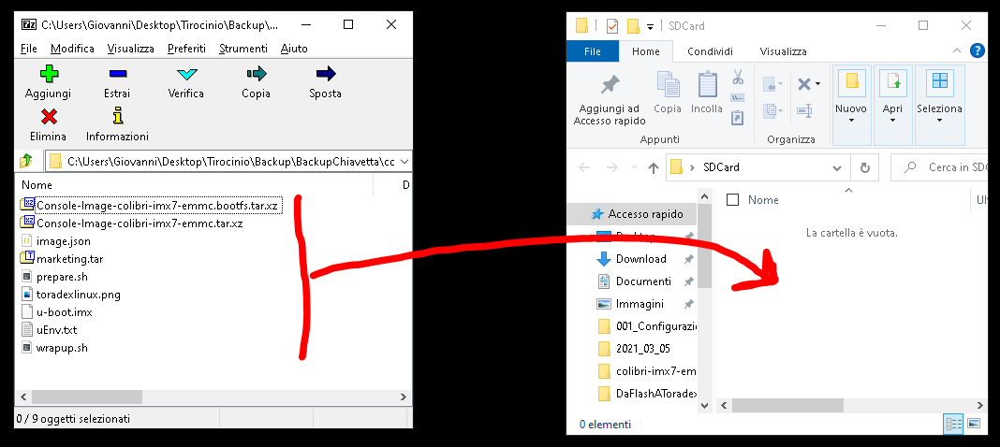
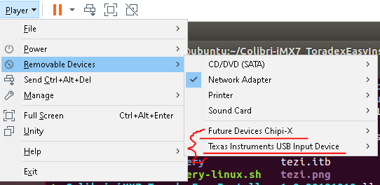
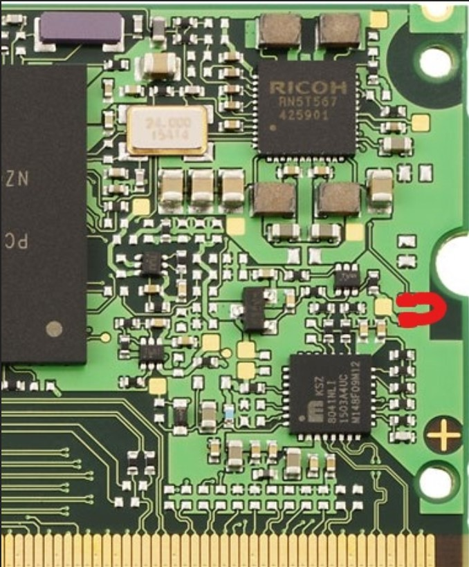
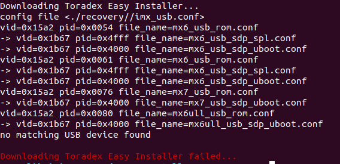
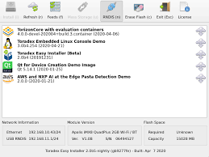
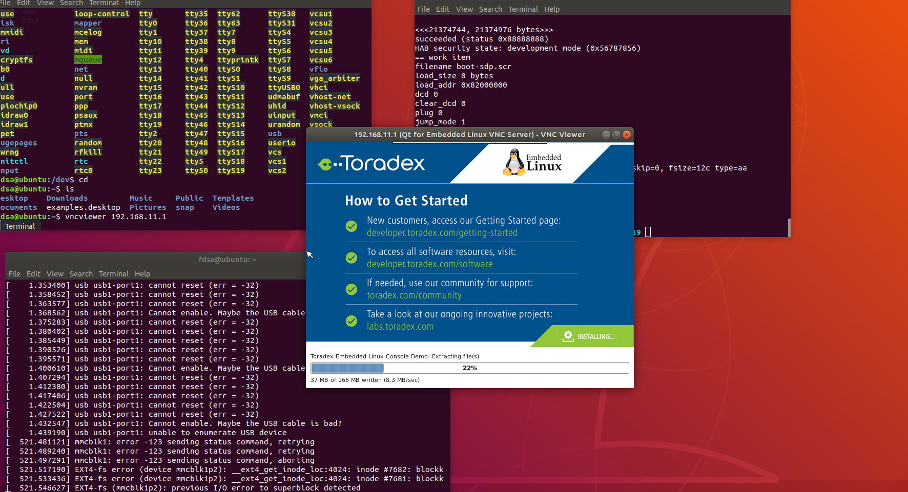

# Installazione del SO compilato con Yocto in Colibri iMX7
Questo tutorial permette di installare il SO creato con Yocto project nel Colibri iMX7

## --**Prerequisiti**--
- **Immagine del SO in formato .tar**
- **VMWare (VirtualBox NON FUNZIONA)**
- **Una VM con Linux**
- **SDCard formattata in FAT32 (Chiavetta USB DA PROBLEMI)**

### Preparazione SDCard
- Collegare l'SDCard al Computer
- Formattarla in FAT32
- Aprire il file: *Colibri-iMX7-eMMC_Console-Image-Tezi_3.0b4-20210302.tar*
- Copiare il contenuto della cartella: *Colibri-iMX7-eMMC_Console-Image-Tezi_3.0b4-20210302* nella SDCard
- 

### Preparazione Linux
- vnc, minicom, git, connessione internet
```bash
cd ~
sudo apt install git wget minicom 

# Installazione di vnc
wget https://www.realvnc.com/download/file/viewer.files/VNC-Viewer-6.20.529-Linux-x64.deb
sudo dpkg -i VNC-Viewer-6.20.529-Linux-x64.deb
```

### Scaricare Toradex Easy Installer
```bash
cd ~
wget https://docs.toradex.com/104570-colibri-imx7-toradexeasyinstaller.zip
sudo apt install unzip 
unzip 104570-colibri-imx7-toradexeasyinstaller.zip
```

### Connettere la board
- Connettere il cavo USB  (Computer(USB)----(microUSB)Colibri_iMX7)
- Nella finestra dei dispositivi di VMWare accedere al dispositivo (Texas Instruments)
    - **Attenzione**: Verranno visualizzati altri dispositivi USB che dovranno essere collegati alla VM in modo che la scheda posso comunicare.
    - 
- A qusto punto la scheda sarà propriamente collegata alla VM
    - **Attenzione**: Come vedremo in seguito potrebbe essere necessario accendere la scheda per vedere alcuni dei dispositivi

## --**Preparazione dei tool all'interno di Linux**--
- Questo è un punto fondamentale per capire se l'installazione sta procedendo

### Workspace
- Aprire tre terminali (per comodità), posizionarli in modo da vederli tutti e tre
    - Terminale **1**:
    - ```bash
        # Toradex Easy Installer
        cd ~
        cd Colibri-iMX7_ToradexEasyInstaller_1.8-20181019/
        # NON PREMERE INVIO NEL PROSSIMO COMANDO
        chmod +x recovery-linux.sh && ./recovery-linux.sh -d
      ```
    - Terminale **2**:
    - ```bash
        # VNC, NON PREMERE invio alla fine
        vncviewer 192.168.11.1
      ```
    - Terminale **3**:
TODO: Spiegazione di come utilizzare minicom per collegarsi alla seriale

## Esecuzione della procedura
- Quando abbiamo Workspace pronto e board collegata possiamo:
    - **Accendere la Board in Recovery Mode**
    - **Utilizzo del Workspace creato precedentemente**
    - **Installazione del SO da SDCard**

### Accensione (Recovery Mode)
- FARE ATTENZIONE IN QUESTO PASSAGGIO:
    - **NON FLETTERE TROPPO LA BOARD**
    - **TOCCARE SOLO I PIN CHE VERRANNO INDICATI**
    - **ESSERE SICURI CHE LA SCHEDA NON TOCCI IL PCB SOTTOSTANTE IN ALCUN MODO**
- Attaccare alimentatore, e accenderlo
- Fare **corto** tra questi due pin
- 
- Tenere in corto i pin e accendere la scheda. (**Tenere in corto 10 secondi**)
- E' possibile rilasciare i pin (dovrebbe fermarsi nel BOOTLOADER)
- Se si avvia il processo di linux boot allora riprovare l'Accensione

### Utilizzo del Workspace
- Terminale **1**:
    - Cliccare INVIO
        - Se appare questo messaggio:
        - 
        - Controlla USB collegate alla VM e ripeti l'Accensione
    - Se non appare il messaggio di Errore allora sta avvenendo la procedura di boot (**Molto lenta**)
    - Sarà necessario aspettare qualche minuto siccome il SO verrà scaricato da internet
- Terminale **2**:
    - Aspettare che Terminale 1 abbia finito la procedura
    - Cliccare INVIO
    - Se tutto è andato bene apparirà una schermata di VNC simile a questa
    - 
- Terminale **3**
TODO: Accedere a Minicom da terminale

### Installazione dell'SO da SDCard
- L'SDCard deve essere preparata come nella sezione **Preparazione SDCard**
- Mettere l'SDCard nello slot del PCB
- Aspettare che in Toradex Easy Install appaia la possibilità di installare l'SO dalla scheda
- Selezionare l'SO 
- Cliccare Install (*in alto a sinistra*)
- Se tutto è andato bene apparirà questa schermata
- 


